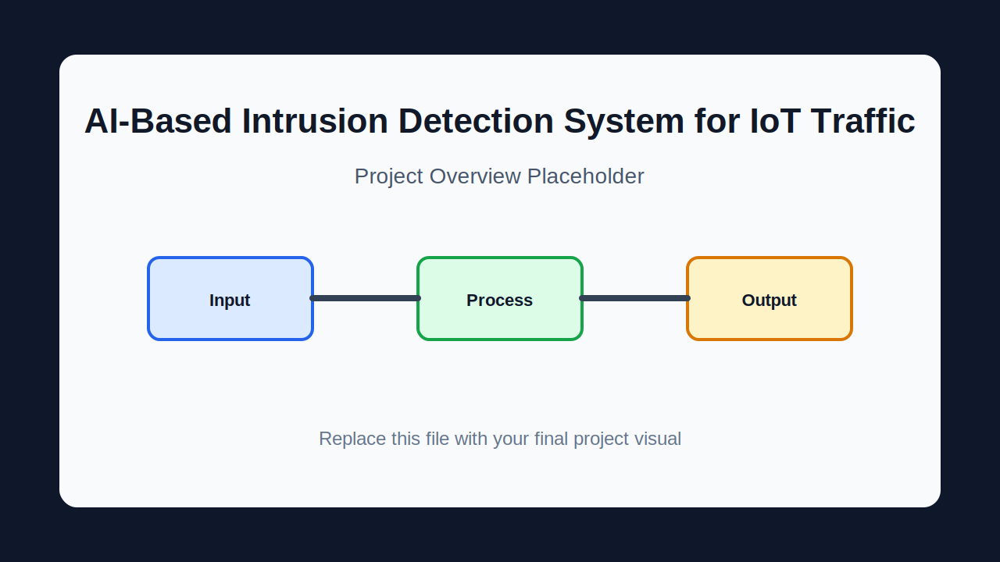
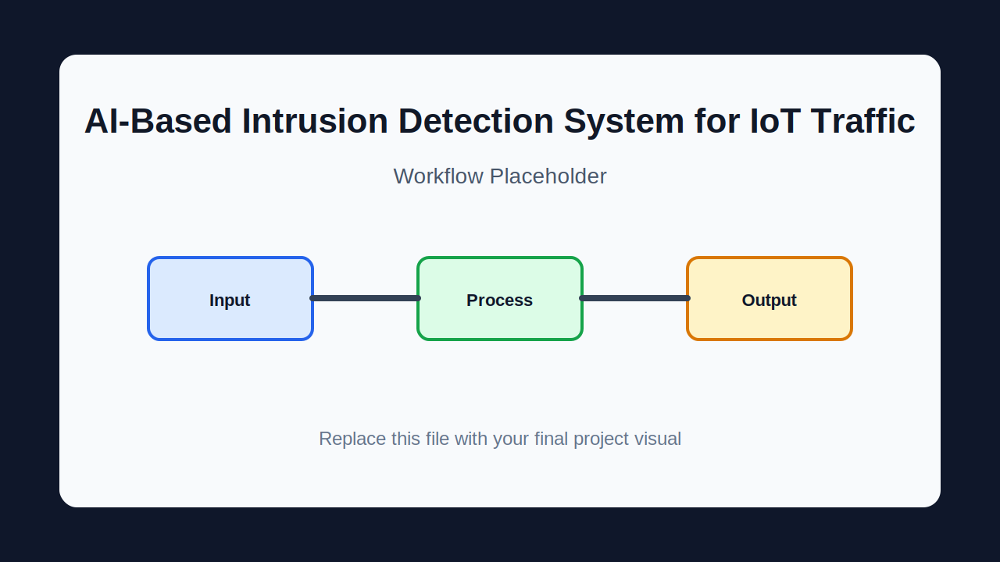



[![Contributors][contributors-shield]][contributors-url]
[![Forks][forks-shield]][forks-url]
[![Stargazers][stars-shield]][stars-url]
[![Issues][issues-shield]][issues-url]

 

  

  <h3 align="center">AI-Based Intrusion Detection System for IoT Traffic</h3>

  

    End-to-end IoT intrusion detection pipeline that captures traffic, extracts CIC-style flow features, classifies streams with a Spark ML Random Forest model, and stores alerts in PostgreSQL.
     
    <a href="docs/GITHUB_DESCRIPTION.md"><strong>Explore the docs »</strong></a>
     
     
    <a href="#usage">View Usage</a>
    &middot;
    <a href="https://github.com/ahmed3bahaa/AI-Based-IDS-/issues/new">Report Bug</a>
    &middot;
    <a href="https://github.com/ahmed3bahaa/AI-Based-IDS-/issues/new">Request Feature</a>
  

  
Table of Contents

  <ol>
    <li><a href="#about-the-project">About The Project</a><ul><li><a href="#built-with">Built With</a></li></ul></li>
    <li><a href="#getting-started">Getting Started</a><ul><li><a href="#prerequisites">Prerequisites</a></li><li><a href="#installation">Installation</a></li></ul></li>
    <li><a href="#usage">Usage</a></li>
    <li><a href="#how-it-works">How It Works</a></li>
    <li><a href="#project-structure">Project Structure</a></li>
    <li><a href="#validation">Validation</a></li>
    <li><a href="#roadmap">Roadmap</a></li>
    <li><a href="#contributing">Contributing</a></li>
    <li><a href="#license">License</a></li>
    <li><a href="#contact">Contact</a></li>
    <li><a href="#acknowledgments">Acknowledgments</a></li>
  </ol>

## About The Project

[![Project overview placeholder][project-screenshot]](#usage)

End-to-end IoT intrusion detection pipeline that captures traffic, extracts CIC-style flow features, classifies streams with a Spark ML Random Forest model, and stores alerts in PostgreSQL.

The repository currently offers:

- Mininet topology with attack hosts and NAT uplink
- HTTP, TCP, and MQTT traffic generation toward IoT targets
- Packet capture with dumpcap
- PCAP to CIC-style CSV conversion
- Spark Structured Streaming classifier
- Saved RF-20 Random Forest model
- PostgreSQL alert storage and SQL initialization

This README follows the shared template requested for the repository set and keeps the claims limited to files and documentation present in this project.

(<a href="#readme-top">back to top</a>)

### Built With

- Python
- Apache Spark
- PostgreSQL
- Docker Compose
- Mininet
- CICFlowMeter
- Bash

(<a href="#readme-top">back to top</a>)

## Getting Started

Follow these steps to clone the repository and run the project locally.

### Prerequisites

- Linux or Ubuntu lab environment
- Python and pip
- Docker Compose for database services
- Mininet and capture tools for live lab use

### Installation

~~~bash
git clone https://github.com/ahmed3bahaa/AI-Based-IDS-.git
cd AI-Based-IDS-
cp .env.example .env
pip install -r requirements.txt
docker compose up -d
~~~

(<a href="#readme-top">back to top</a>)

## Usage

Useful commands and entry points:

~~~bash
bash run_live_detection.sh
~~~

~~~bash
bash capture.sh
~~~

~~~bash
python ids_streaming.py
~~~

~~~bash
python mininet_attack.py
~~~

### Visual Placeholders

Placeholder images are included under `docs/images/` so you can replace them manually later without changing the README layout.

  
  

Suggested final visuals:

- Project overview screenshot or main terminal output.
- Workflow, architecture, or data-flow diagram.
- Example result, dashboard, report, or generated artifact screenshot.
- Short GIF only when it is small and useful.

Avoid committing large raw videos, private datasets, credentials, runtime logs, or generated secrets. Use sanitized screenshots and diagrams.

(<a href="#readme-top">back to top</a>)

## How It Works

`	ext
Mininet or LAN traffic -> packet capture -> PCAP to CSV -> Spark model RF-20 -> prediction label -> PostgreSQL IDS alerts
`

(<a href="#readme-top">back to top</a>)

## Project Structure

- ids_streaming.py - streaming detection pipeline
- mininet_attack.py - attack traffic lab script
- capture.sh and pcap_to_csv.sh - packet capture and feature extraction helpers
- sql/ - database initialization
- RF-20/ - saved Spark ML model artifacts
- docs/ - architecture and deployment guides

(<a href="#readme-top">back to top</a>)

## Validation

Run the most relevant checks for this repository:

~~~bash
python -m py_compile ids_streaming.py mininet_attack.py gen_schema.py
~~~

~~~bash
docker compose config
~~~

Some validations depend on local tools, services, datasets, API credentials, or a configured lab environment.

(<a href="#readme-top">back to top</a>)

## Roadmap

- [ ] Replace placeholder images with final screenshots or diagrams.
- [ ] Keep setup commands synchronized with the current project files.
- [ ] Add more examples or test fixtures when the project grows.
- [ ] Add a repository-level license if the project will be reused outside its original context.

See the [open issues](https://github.com/ahmed3bahaa/AI-Based-IDS-/issues) for proposed features and known issues.

(<a href="#readme-top">back to top</a>)

## Contributing

Contributions are welcome for documentation, examples, tests, and implementation improvements.

1. Fork the project.
2. Create your feature branch:

   ~~~bash
   git checkout -b feature/AmazingFeature
   ~~~

3. Commit your changes:

   ~~~bash
   git commit -m "Add some AmazingFeature"
   ~~~

4. Push to the branch:

   ~~~bash
   git push origin feature/AmazingFeature
   ~~~

5. Open a pull request.

(<a href="#readme-top">back to top</a>)

### Top Contributors

## License

No repository-level license file was verified in this project. Add a license before reuse or distribution outside the intended coursework, lab, or prototype context.

(<a href="#readme-top">back to top</a>)

## Contact

Project owner: [@ahmed3bahaa](https://github.com/ahmed3bahaa)

Project Link: [https://github.com/ahmed3bahaa/AI-Based-IDS-](https://github.com/ahmed3bahaa/AI-Based-IDS-)

(<a href="#readme-top">back to top</a>)

## Acknowledgments

- README structure adapted from [ahmed3bahaa/readme-template](https://github.com/ahmed3bahaa/readme-template).
- Project files, reports, fixtures, and documentation included in this repository.

(<a href="#readme-top">back to top</a>)

[contributors-shield]: https://img.shields.io/github/contributors/ahmed3bahaa/AI-Based-IDS-.svg?style=for-the-badge
[contributors-url]: https://github.com/ahmed3bahaa/AI-Based-IDS-/graphs/contributors
[forks-shield]: https://img.shields.io/github/forks/ahmed3bahaa/AI-Based-IDS-.svg?style=for-the-badge
[forks-url]: https://github.com/ahmed3bahaa/AI-Based-IDS-/network/members
[stars-shield]: https://img.shields.io/github/stars/ahmed3bahaa/AI-Based-IDS-.svg?style=for-the-badge
[stars-url]: https://github.com/ahmed3bahaa/AI-Based-IDS-/stargazers
[issues-shield]: https://img.shields.io/github/issues/ahmed3bahaa/AI-Based-IDS-.svg?style=for-the-badge
[issues-url]: https://github.com/ahmed3bahaa/AI-Based-IDS-/issues
[project-screenshot]: docs/images/project-overview-placeholder.svg
